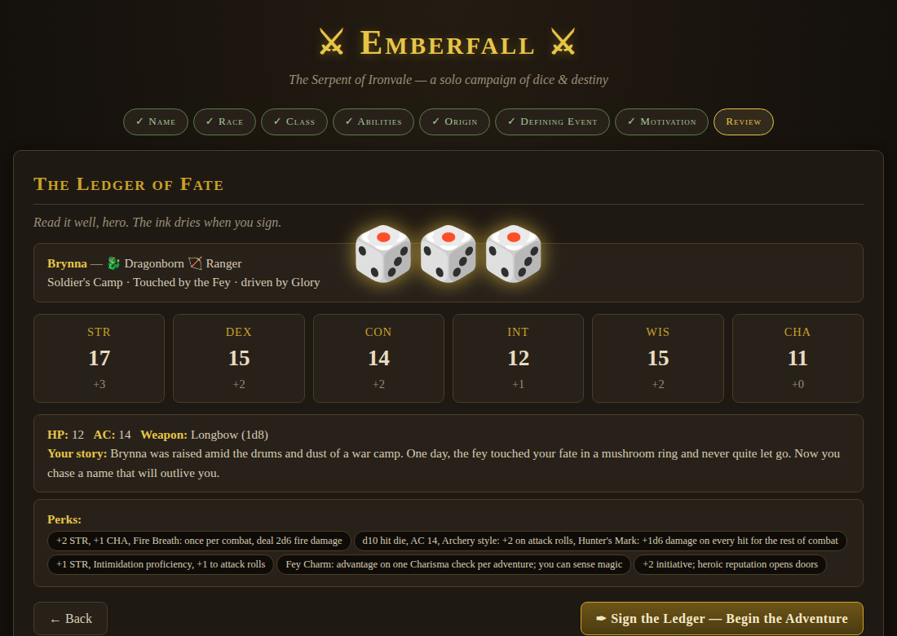
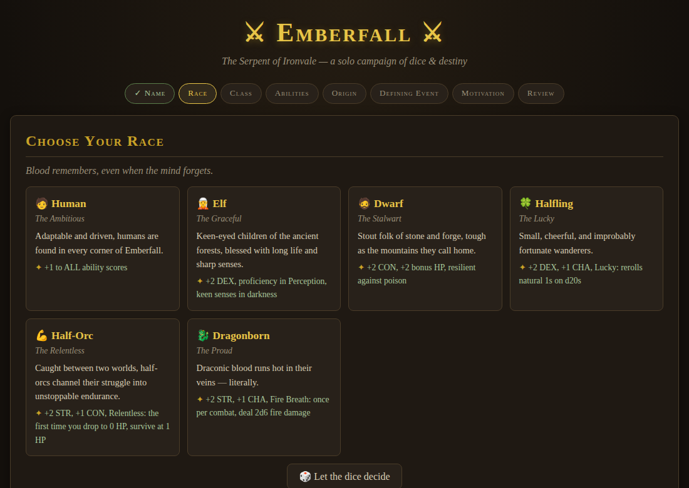
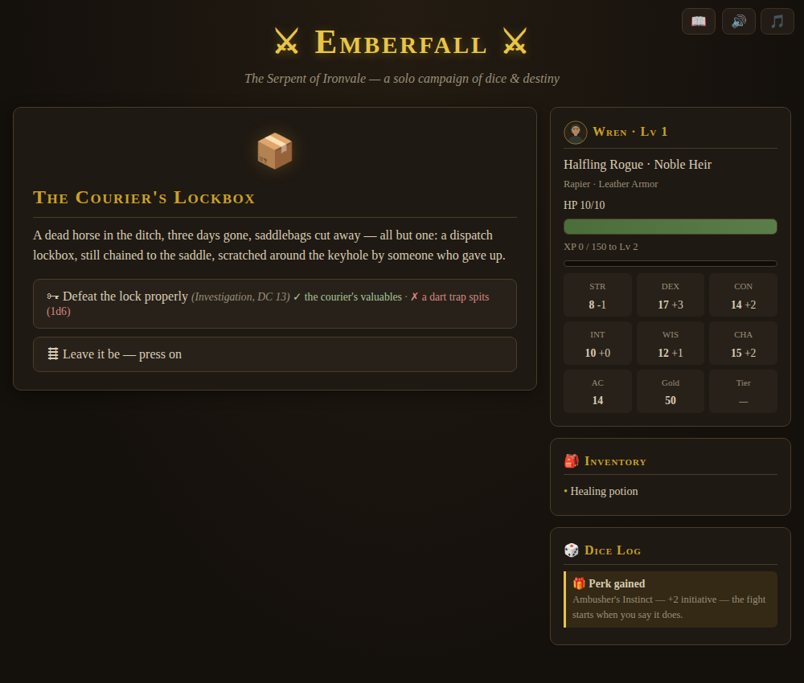
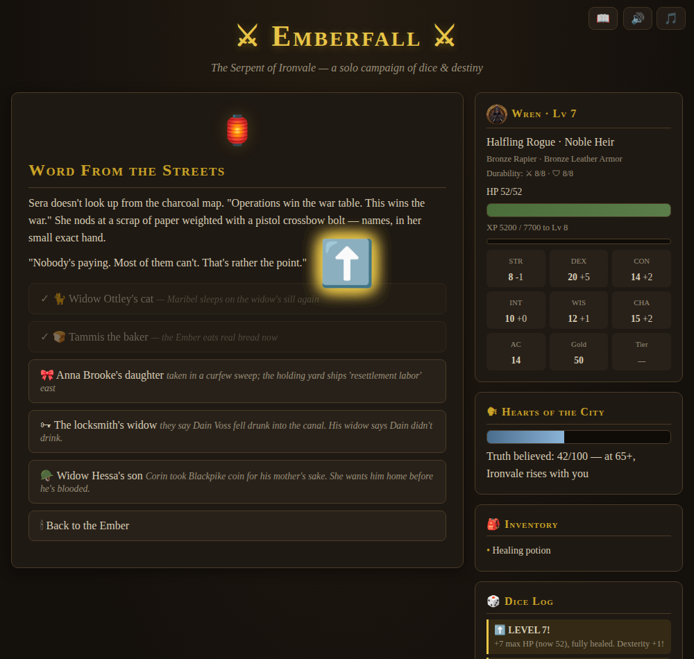

# ⚔ Emberfall: The Serpent of Ironvale

A single-file, browser-based solo RPG with D&D-style rules — no installs, no dependencies, no server. Open `index.html` and play.

**▶ [Play it here](https://mydastactus.github.io/emberfall-rpg/)**

## The Story

**Campaign 1 — The Serpent of Ironvale.** Goblin raids are strangling the city of Ironvale — and High Councilor Thaddeus Thorne, the beloved, grandfatherly patron hiring heroes to stop them, is the man pulling every string. Rise from level 1 to 6, gather the evidence coin by coin and ledger by ledger, and decide how the conspiracy ends.

**Campaign 2 — The Coward King.** Your hero continues into the counterstroke (levels 6–10): the ledger "proven" a forgery, a staged assassination rescue, and the ultimate frame-job — a good King maneuvered out of his own city by false intelligence, branded a coward and a thief by a forged abdication, while his "savior" takes the crown as Lord Protector. Run a resistance from a tannery cellar, win back the hearts of a propagandized city, find the broken King in the wilderness, and take Ironvale back. Your Campaign 1 choices — including who Thorne became at your hands — shape how it opens and how it can end.

## Features

**Deep character creation** — 6 races, 5 classes, ability scores by 4d6-drop-lowest or standard array, and a three-part backstory (origin, defining event, motivation) you can hand-pick or leave to the dice. Every backstory choice grants a mechanical perk *and* unlocks unique dialogue and paths through the campaign.

**D&D-style rules engine** — d20 skill checks with advantage, armor class, proficiency that scales with level, turn-based combat with initiative, class abilities, critical hits, and a live dice log showing every roll's math. Enemies fight like they mean it: cowards break and flee, soldiers raise shields and parry, wolves hunt in packs — and bosses telegraph massive blows you can Defend against, bash you senseless, hamstring your footwork, poison your blood, and bellow war cries only the dragonfire-touched can ignore. Every status is visible, every save is rolled in the open.

**A living town** — Brannock's Forge for weapon and armor upgrades, Zephyrine's Curiosities for potions and magic items, a training yard to learn new skill proficiencies, and a tavern whose rumors foreshadow each chapter.

**A real armory** — every class has weapon choices with honest tradeoffs (greataxes vs. sword-and-shield, warhammers, flails, three kinds of bow, twin daggers, kamas, hand crossbows) and class-true armor rules: fighters wear anything, rangers top out at scale mail, rogues sneak worse in medium armor, and wizards rely on the Mage Armor ward — plus swappable attack cantrips and learnable spells (Burning Hands, Sleep, Lightning Bolt). Cheap field bandages and alchemist's fire round out the kit, bought in shops or looted along the way.

**Branching consequences** — an evidence system decides whether the King believes you before or after the knives come out; a moral fork in Chapter 3 echoes into the finale; and multiple fates await the villain.

**Red herrings that bite** — not every lead is real. Planted files, framed quartermasters, and grieving "defectors" wait for investigators who fail their rolls — and carrying unverified evidence into the throne room can sink a case built on truth. Verify before you accuse.

**Patrols & random encounters** — the roads between missions hold ambushes, wolf packs, overturned carts, wayside shrines, and gray riders with strange seals. Leveling is earned now: story missions alone won't carry you, and the wise hero rides patrol.

**Roads of chance** — the ride to a mission doesn't always go to plan. About one departure in three is waylaid: scavenger ambushes, deserters' tolls, half-buried strongboxes, smugglers' caches, loyalist dead-drops — and the occasional chest that is, on closer inspection, faintly *wet*. Every chest and cache is opened on a skill check with the reward and the trap printed right on the button. Fights can drop spoils too: gold, potions, alchemist's fire — and four rare unique treasures (the Whetstone of Old Wars, Wayfarer's Boots, the Ironheart Locket, the Duelist's Band) that no shop will ever sell and no save will ever drop twice.

**A nation's story, beginning** — Thorne answered to someone. The gray wax seal of the Second Chair waits in the epilogue, and future campaigns will carry the fight to the rest of the realm.

**A living soundscape, still one file** — a warm royalty-free fantasy ambient score is embedded right in the game and adapts to the fiction: full and bright in town, quieter on the road, and ducked low beneath synthesized war drums and dread drones when blades come out. Every sound effect is synthesized in your browser at the moment it plays: dice clatter, sword rings and crits, coin clinks, healing chimes, war-cry growls, spell shimmers, and a level-up fanfare. Toggle sound and music anytime from the corner controls.

**Character portraits** — a consistent hand-built vector portrait style for every major face in the realm: Thorne's grandfatherly warmth, the crowned King, Sera's scar, Vail's duelist stare, Zarga's tusks and bone beads — plus a portrait for each hero class, in dialogue, combat, and the hero sheet.

**Perks & traits at every level** — leveling is a choice now, not just a bigger number. Every level offers one of three class-flavored perks (a fighter braces a shield wall, a rogue befriends every fence in the realm, a wizard overcharges spells), levels 5 and 10 offer a defining **Trait** (Juggernaut, The Ghost, Archmage's Surge...), and the perks you pass over rotate back at levels 6–9. Ninety perks across five classes, every one mechanically real — and old saves catch up with retroactive picks the moment they load.

**Hero sheet & journal** — one tap on the 📖 opens your full character sheet (stats, gear, every backstory perk explained, every level perk and trait you've chosen) and a living journal that recaps the story so far in light of *your* choices, flags unverified evidence, and tracks the Hearts of the City.

**Autosave + save codes** — your progress autosaves in the browser after every scene, with a Continue button on the title screen. Save codes at the Chronicler's Quill remain as manual backup and for carrying heroes between devices.

## Credits

Designed by David Thomas. Built with [Claude](https://claude.com). Ambient music: royalty-free fantasy ambient track.

## License

MIT — see [LICENSE](LICENSE). Play it, fork it, mod it, run it at game night.
